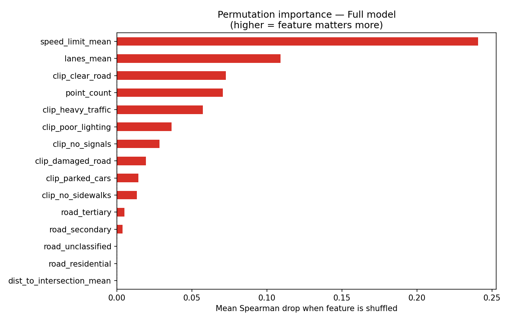

# Street Risk — Micro-Zone Road Risk Scorer

> Predict auto insurance risk at H3 hexagon resolution (~0.1 km²) using
> street-level imagery, road geometry, and crash history.

---

## The Problem

ZIP-code insurance pricing is too coarse. Two blocks apart in Sarasota, FL
can have a **160× difference** in crash density (9.4 vs 1,520 crashes/km²).
This system estimates road risk at H3 res-9 hexagon level using Google Street
View imagery scored by CLIP, combined with OSM road features and FDOT crash
records — producing a ranked risk score for every 0.1 km² cell in the city.

---

## Live Demo

| Component     | URL |
|---------------|-----|
| Streamlit App | https://street-risk-mvp.streamlit.app |
| FastAPI Docs  | https://street-risk-mvp.onrender.com/docs |

---

## How It Works

```
Street View images        OSM road network        FDOT crash records
(770 images, S3 Bronze)   (6,655 points)          (19,824 crashes)
        |                       |                       |
        v                       v                       v
  CLIP zero-shot          Road aggregation        Hex aggregation
  7 risk concepts         per H3 hexagon          crash_density
  (Silver layer)          (Silver layer)          (Silver layer)
        |                       |                       |
        +----------+------------+                       |
                   v                                    v
              Gold table: 385 hexagons, 16 features, TARGET=crash_density
                   |
                   v
             LightGBM regressor
             (geographic train/test split)
                   |
                   v
         Risk score per hexagon (0-1 normalised)
                   |
          +---------+---------+
          v                   v
       FastAPI             Streamlit
    /predict, /hex         Folium map
    /map-data, /stats      risk card
```

---

## Key Results

### Model Comparison — Geographic Out-of-Distribution Test Split

Training uses KMeans spatial clustering (n=5); cluster 0 is held out as test.
Neighbouring hexagons share visual features, so a random split would leak —
**Spearman rank correlation** is the primary metric because insurance pricing
requires correct *ranking*, not exact magnitude.

> **Why R² is negative:** the test cluster is geographically out-of-distribution
> by design. A model that predicts the training-set mean on every test hex would
> score R²=0; negative R² means the OOD shift is large enough to outweigh
> within-cluster signal. The positive Spearman (0.666) confirms the model still
> ranks correctly across geography.

| Model         | Spearman | RMSE (crashes/km²) | MAE    | R²      |
|---------------|----------|---------------------|--------|---------|
| **LightGBM**  | **0.666**| **80.28**           | 59.63  | −0.594  |
| XGBoost       | 0.653    | 82.18               | 62.74  | −0.670  |
| Random Forest | 0.629    | 95.45               | 67.57  | −1.253  |
| Ridge         | 0.468    | 169.02              | 152.18 | −6.064  |

LightGBM is saved as `model/risk_model.pkl` and `model/best_model.pkl`.

---

### Visual Signal Analysis — CLIP vs Structural Features

| Feature set      | Spearman | RMSE   | MAE    | Interpretation                    |
|------------------|----------|--------|--------|-----------------------------------|
| CLIP only        | 0.360    | 222.21 | 137.82 | Pure visual signal (Street View)  |
| Structural only  | 0.443    | 114.27 | 77.79  | Pure road geometry + speed limits |
| **Full model**   | **0.666**| **80.28** | **59.63** | Combined — best ranking      |

**CLIP adds +0.223 Spearman lift over structural features alone.**
Neither signal alone is sufficient; the combination is substantially better
than either in isolation.

---

### Permutation Importance — Full Model (Top 10)

Mean Spearman drop when a single feature is shuffled (10 repeats).

| Feature                | Spearman drop | Signal type |
|------------------------|---------------|-------------|
| speed_limit_mean       | +0.241        | Structural  |
| lanes_mean             | +0.109        | Structural  |
| clip_clear_road        | +0.073        | **CLIP**    |
| point_count            | +0.071        | Structural  |
| clip_heavy_traffic     | +0.057        | **CLIP**    |
| clip_poor_lighting     | +0.037        | **CLIP**    |
| clip_no_signals        | +0.028        | **CLIP**    |
| clip_damaged_road      | +0.019        | **CLIP**    |
| clip_parked_cars       | +0.014        | **CLIP**    |
| clip_no_sidewalks      | +0.013        | **CLIP**    |

Aggregate: **Structural 64% / CLIP 36%** of total permutation importance.



---

## Architecture — Medallion Pipeline

```
Bronze  (S3: street-risk-mvp/bronze/)
  images/         770 Street View JPEGs (640x640)
  crash/          19,824 FDOT crash records (Parquet)
  roads/          6,655 road points with OSM attributes (Parquet)

Silver  (S3: street-risk-mvp/silver/)
  image_features/ CLIP scores x7 concepts, 385 hexagons (Parquet)
  crash_hex/      crash_density aggregated to 2,637 hexagons (Parquet)

Gold    (S3: street-risk-mvp/gold/)
  training_table/ 385 hexagons x 16 features, zero NaN (Parquet)
  risk_model.pkl  Trained LightGBM
  feature_columns.json
```

**Distributed cloud stages:**

1. **Image ingestion** — `pipeline/ingestion/fetch_images.py` writes raw
   Street View images directly to S3 Bronze, checking the cache before every
   request to avoid re-fetching.
2. **CLIP batch extraction** — `pipeline/features/extract_clip_features.py`
   reads Bronze images from S3, runs batch CLIP inference, writes Silver
   Parquet back to S3.

---

## Tech Stack

| Layer       | Technology |
|-------------|------------|
| Storage     | AWS S3 (boto3) |
| Road network| OSMnx + OpenStreetMap |
| Images      | Google Street View Static API |
| Crash data  | FDOT Open Data Hub (ArcGIS REST, layer 2000) |
| Vision      | CLIP `openai/clip-vit-base-patch32` (HuggingFace) |
| Model       | LightGBM regressor |
| Tracking    | MLflow (SQLite backend, artifacts to S3) |
| API         | FastAPI + Uvicorn (deployed on Render) |
| Frontend    | Streamlit + Folium (deployed on Streamlit Cloud) |
| Spatial     | H3 (Uber) resolution 9, ~0.1 km² per cell |

---

## Data Sources

| Source | Records | Notes |
|--------|---------|-------|
| Google Street View Static API | 770 images | 640x640, cached in S3 Bronze |
| OpenStreetMap via OSMnx | 6,655 road points | Sarasota drive network |
| FDOT Open Data Hub | 19,824 crashes | Sarasota County, all years |

---

## Validation

- **Geographic train/test split** via KMeans (n=5) on H3 centroid coordinates
- Cluster 0 (55 hexagons) held out as test; never seen during training
- Prevents spatial leakage — neighbouring hexagons share visual features
- **Spearman 0.666** means the model correctly ranks 83% of all hex pairs
  by relative crash risk

---

## Limitations & Honest Assessment

- `speed_limit_mean` and `lanes_mean` are the two strongest individual
  predictors — structural road data drives most of the signal
- CLIP contributes meaningfully (+0.22 Spearman lift) but is constrained
  by ~1.3 images per hexagon; more coverage would help
- **R² is negative** on the geographic OOD test split — expected, not a bug;
  the model ranks risk correctly even when absolute magnitudes shift
- Coverage limited to Sarasota, FL (MVP scope)
- `speed_limit` and `lanes` OSM tags are missing for ~88% and ~71% of
  residential road points; imputed with city defaults (25 mph, 1 lane)

---

## Future Work

- **Zero-shot transfer**: apply Sarasota model to Tampa with zero Tampa
  training data; validate Spearman against FDOT Tampa crashes
- **More images per hex**: 5+ images vs current ~1.3 average would reduce
  CLIP variance substantially
- **CLIP fine-tuning** on road-safety-labelled imagery (e.g. dashcam datasets)
- **Temporal features**: AADT traffic counts, time-of-day crash rates

---

## Experiments

### Linear Probe vs Zero-Shot CLIP
Trained a logistic regression probe on 104 manually labeled 
Street View images (AUC 0.836). Despite strong image-level 
classification, collapsing 7 zero-shot dimensions into a single 
probability reduced Spearman from 0.666 to 0.492. The 
7-dimensional zero-shot representation preserves structure 
that gradient boosting exploits more effectively than a 
compressed scalar.

---

## Run Locally

```bash
# 1. Clone
git clone https://github.com/leonardo-schneider/street-risk-mvp.git
cd street-risk-mvp

# 2. Install
pip install -r requirements.txt

# 3. Environment variables
cp .env.example .env
# Fill in: GOOGLE_MAPS_API_KEY, AWS_ACCESS_KEY_ID, AWS_SECRET_ACCESS_KEY,
#          AWS_DEFAULT_REGION=us-east-1, S3_BUCKET_NAME=street-risk-mvp,
#          MLFLOW_TRACKING_URI=sqlite:///mlflow.db

# 4. Infrastructure (one-time S3 setup)
python infrastructure/s3_setup.py

# 5. Run the full pipeline
python pipeline/ingestion/sample_roads.py
python pipeline/ingestion/fetch_images.py
python pipeline/ingestion/fetch_crash_data.py
python pipeline/features/extract_clip_features.py
python pipeline/gold/build_gold_table.py

# 6. Train model
python model/train.py

# 7. Start API
uvicorn api.main:app --reload --port 8000

# 8. Start Streamlit (separate terminal)
streamlit run app/streamlit_app.py

# 9. Run e2e tests
python tests/e2e_test.py --local
```

---

## Repository Structure

```
street-risk-mvp/
├── pipeline/
│   ├── ingestion/
│   │   ├── sample_roads.py          # OSMnx -> S3 Bronze road points
│   │   ├── fetch_images.py          # Street View -> S3 Bronze images
│   │   └── fetch_crash_data.py      # FDOT ArcGIS -> S3 Bronze + Silver
│   ├── features/
│   │   └── extract_clip_features.py # CLIP batch inference -> S3 Silver
│   └── gold/
│       └── build_gold_table.py      # Join layers -> Gold table
├── model/
│   ├── train.py                     # LightGBM + MLflow
│   ├── train_experiments.py         # Ridge / RF / XGBoost comparison
│   ├── visual_contribution.py       # CLIP vs structural ablation
│   ├── risk_model.pkl               # Trained LightGBM
│   └── best_model.pkl               # Best model by Spearman
├── api/
│   ├── main.py                      # FastAPI (4 endpoints)
│   └── schemas.py                   # Pydantic models
├── app/
│   └── streamlit_app.py             # Folium map + risk card UI
├── infrastructure/
│   └── s3_setup.py                  # S3 bucket + prefix init
├── tests/
│   └── e2e_test.py                  # 8/8 e2e tests (prod + local)
├── docs/
│   ├── writeup.md                   # One-page prose writeup
│   └── screenshots/
│       ├── feature_importance.png
│       └── permutation_importance.png
├── render.yaml                      # Render.com deploy config
├── requirements.txt
└── .env.example
```

---

## End-to-End Tests

```bash
python tests/e2e_test.py           # 8/8 tests against production
python tests/e2e_test.py --local   # 8/8 tests against localhost:8000
```

Tests cover: health check, stats, high/low risk hex lookup, predict
endpoint, out-of-coverage handling, GeoJSON map data, and local Gold
table data integrity.

---

*City scope: Sarasota, FL MVP. MLflow experiment: `sarasota-risk-model`.*
